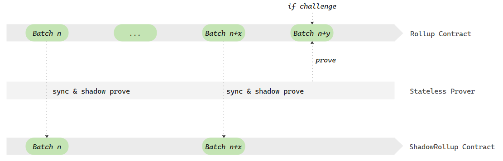

# Morph prover
Generate ZK Proof for L2 blocks.

A high-performance zero-knowledge proof system for Layer 2 blocks validation. Built with SP1 zkVM, it implements an innovative shadow proving mechanism to handle proof challenges efficiently. The system generates PLONK proofs that are verifiable on Ethereum, supporting both synchronous and shadow proving modes for enhanced security and reliability.

Key features:

SP1 zkVM integration
EVM-compatible PLONK proofs
Stateless proving architecture
Challenge-response mechanism
Shadow proving support
The prover serves as a crucial component in Morph L2's scaling solution, ensuring secure and verifiable transaction batches on Ethereum mainnet.

## Overview
### How the prover handles challenges and the process of shadow proving

## Requirements
- [Rust](https://rustup.rs/)
- [SP1](https://docs.succinct.xyz/docs/sp1/introduction)


## Build & Run
### Build verifier-application as a RISC-V binary
To build the program to risc-v bin:

```sh
cd bin/client
cargo prove build  --docker --tag v4.0.0-rc.3 --output-directory ./bin/client/elf/
```

This will output the compiled ELF to the file bin/client/elf/riscv32im-succinct-zkvm-elf.

### Execute the Program


To run the program without generating a proof:


```sh
cd bin/host
RUST_LOG=info TRUSTED_SETUP_4844=../../configs/4844_trusted_setup.txt cargo run --release
```
or

```sh
RUST_LOG=info TRUSTED_SETUP_4844=../../configs/4844_trusted_setup.txt  cargo run --release -- --block-path ../../testdata/devnet_small_batch_traces.json
```

This will execute the program and display the output.


### Generate an EVM-Compatible (PLONK) Proof

> [!WARNING]
> You will need at least 128GB RAM to generate the PLONK proof.

To generate a PLONK proof that is small enough to be verified on-chain and verifiable by the EVM:

```sh
cd bin/host
RUST_LOG=info TRUSTED_SETUP_4844=../../configs/4844_trusted_setup.txt  cargo run --release -- --block-path ../../testdata/devnet_small_batch_traces.json --prove
```

This command also generates a fixture that can be used to test the verification of SP1 zkVM proofs
inside Solidity.

## Retrieve the Verification Key

To retrieve your `programVKey` for your on-chain contract, run the following command:

```sh
cd bin/host
RUST_LOG=info cargo run --bin vkey --release
```

## Verify the SP1 binaries
First retrieve the verification key, and then confirm whether it is consistent with the vkey in the verifier contract.
The vkey in the contract is defined in the programVkey field in ```contracts/src/deploy-config/l1.ts``` of the mono repo.

* On-chain verification key query path:
```
+----------------------+  
|     Rollup.sol       |  
+----------------------+  
           │  
           │ call  
           ▼  
+----------------------+  
|        verifier      |  
| (MultipleVersion     |  
|  RollupVerifier.sol) |  
+----------------------+  
           │  
           │ call  
           ▼  
+----------------------+  
|    latestVerifier    |  
| (ZkEvmVerifierV1.sol)|  
+----------------------+  
           │  
           │ read 
           ▼  
+----------------------+  
|    programVkey       |  
+----------------------+
```

### Build plonk circuits
If the plonk circuit artifacts do not exist, you will need to create them to support generating plonk ploof.
```
git clone https://github.com/morph-l2/sp1.git && cd sp1 && git checkout v4
cd crates/prover
RUST_LOG=info make build-circuits
```
Move all plonk related build products to ~/.sp1/circuits/plonk/$(SP1_CIRCUIT_VERSION), SP1 prover will load it when starting to generate plonk proofs.


## Run prover in service mode

### Build
```
cd bin/server && RUST_LOG=info RUSTFLAGS="-C target-feature=+avx2,+avx512f" cargo build --release
```

### Run
```
export PROVER_PROOF_DIR=/data/proof
export PROVER_L2_RPC=http://127.0.0.1:8545
./target/release/prover-server
```
The prover server will listen for requests on port 3030

### Send a prove request
```
curl -X POST -H "Content-Type: application/json" -d '{"jsonrpc": "2.0", "batch_index": 12345, 
"start_block": 101, "end_block": 201, "rpc": "http://localhost:8545", "id": 1}'  http://127.0.0.1:3030/prove_batch
```
